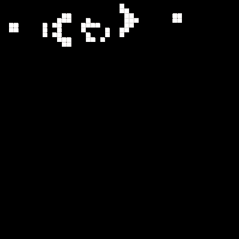

# Conway's Game of life

This is the implementation of [Conway's Game of Life](https://en.wikipedia.org/wiki/Conway's_Game_of_Life).

Currently it uses:
* Two 1d arrays to represent game field.  
* List of live cells and thier neighbors to work through it.

TO DO:
- [x] Optimize algorithm by adding changing list that holds only alive cells and work through it.
- [ ] Optimize algorithm by adding look-up table.
- [ ] Allow user to interact with the game: set the initial state of the field; change game speed.

